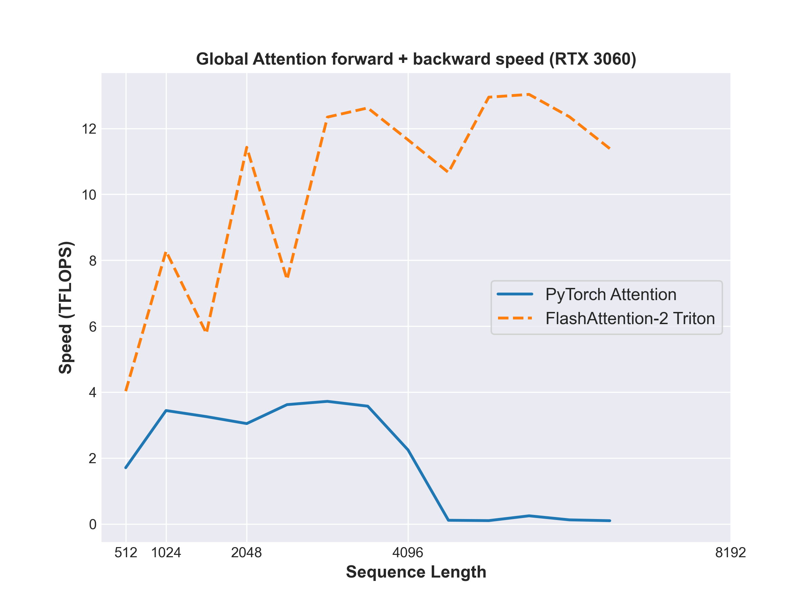

# FlashAttention-2 in Triton for Sliding Window Attention

This repository provides an implementation of FlashAttention-2 **Forward and Backward Pass** for self-attention in Triton which handles **Sliding Window Attention**. FlashAttention-2 is a memory-efficient algorithm for computing attention that significantly reduces memory bandwidth requirements and improves performance on GPU hardware.

This implementation supports several configurations for both Forward and Backward Pass including:

- **Sliding Window Attention** !!!
- **Global Attention**
- **Causal Attention**

Note:
- Partially inspired by OpenAI's Fused Attention in Triton.
- This implementation is intended for educational purposes and can be optimized.
- No dropout is applied.
- Uses FP16 precision.

## Introduction

This implementation replicates the trend described in the FlashAttention-2 paper, with significant performance improvements compared to traditional attention mechanisms.

<div align="center">
  
</div>

<br>

--> Up to 2-10x speedup compared to a standard PyTorch attention implementation.

This implementation differs slightly from the pseudo-code in the original paper, mainly in the backward pass, which is modified based on the Triton documentation implementation for better performance.

## Benchmarking

Measure the speed (in TFLOPs/s) of FlashAttention-2 in Triton versus standard PyTorch attention for the forward + backward pass with the `benchmark.py` file:

```bash
python -m tests.benchmark --attn_mode 'sliding_window' --window_size 500
python -m tests.benchmark --attn_mode 'causal' --batch_size 16
python -m tests.benchmark --attn_mode 'global' --num_heads 8
```

## Testing

Compare the results between the PyTorch and Triton implementations with the `test.py` file:

```bash
python -m tests.test --attn_mode 'sliding_window' --window_size 1000
python -m tests.test --attn_mode 'causal' --head_dim 128
python -m tests.test --attn_mode 'global' --batch_size 8
```

Each test verifies:
- Numerical accuracy against a standard PyTorch implementation.
- Gradient correctness.

## Installation

```bash
git clone https://github.com/MaxLSB/flash-attn2.git
```

## To Do

- Fix the current restrictions for Sliding Window:
  - SEQ_LEN >= 4 * BLOCK_SIZE
  - 2 * BLOCK_SIZE <= WINDOW_SIZE <= SEQ_LEN 
- Improve the Autotune in the backward pass


<!-- Other ideas:
- Multi-Head Latent Flash Attention
- GQA Flash Attention
- Native Sparse Attention with Flash Attention -->
